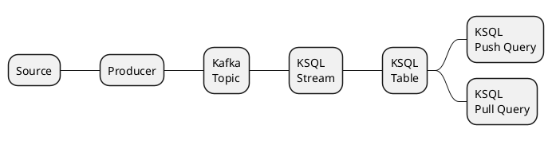
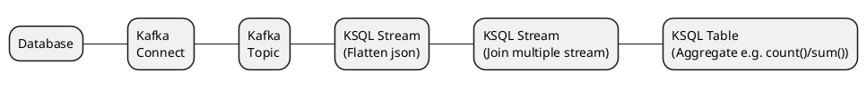

# Apache Kafka 

## KSQL Concepts
### Overview


### Sample flow


### Streams vs Tables
| STREAM| TABLE|Action|
|-------|------|------|
| Key column type|KEY| PRIMARY KEY|
| NON NULL key constraint | No| Yes Messages in the Kafka topic with a NULL PRIMARY KEY are ignored.|
| Unique key constraint   | No Messages with the same key as another have no special meaning. | Yes Later messages with the same key replace earlier.|
| Tombstones| No Messages with NULL values are ignored.| Yes NULL message values are treated as a tombstone Any existing row with a matching key is deleted. |

### Push and Pull Queries
**Push Query**
1. Point in time
2. Need to specify WHERE condition to select only a single key
3. Fast
4. Suitable for request/reply pattern

**Pull Query**
1. Subscribe to changes
2. Need to specify EMIT CHANGES in order to show the latest changes
3. Takes time on initial query due to loading the whole stream, fast when it's streaming. 
4. Suitable for asynchronous streaming 

### Rest API Endpoint Example
*currently not working*
```bash
curl -XPOST -H "Content-Type: application/json" http://cs-docker-dev:8088/query -d `{"sql": "select * from guacamole_user_connection_count where name="cychau@gmail.com"}`
```

## Reference
1. [Querying Debezium Change Data Events With KSQL](https://debezium.io/blog/2018/05/24/querying-debezium-change-data-eEvents-with-ksql/)
2. [Kafka Gitbook Doc](https://jaceklaskowski.gitbooks.io/apache-kafka/kafka-overview.html)
3. [KSQL Syntax Reference](https://docs.ksqldb.io/en/latest/developer-guide/syntax-reference/)
